# Diplom project — Kubernetes CI/CD platform- Teplov Mihail
# Созданные ресурсы

Grafana:
  URL      : http://93.77.182.96
  User     : admin  
  Password : CgGUv6rfJHpGdDdtx0WJsJif    (Пароль генерируется автоматически при создании машин, выходит после выполнения   скрипта)    

Application:  
  http://93.77.182.96/app       


  PS несколько раз тестировал поэтому ip сейчас другие на работу не влияет 
# Скриншоты

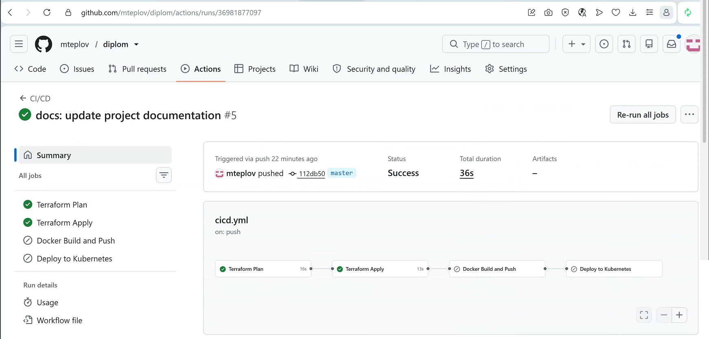
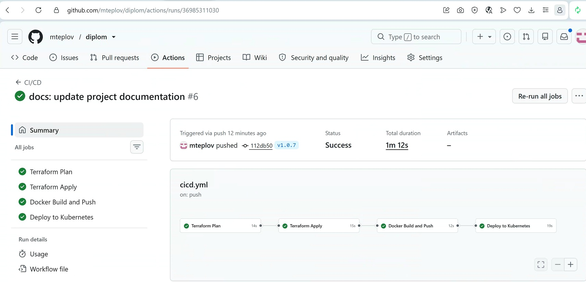
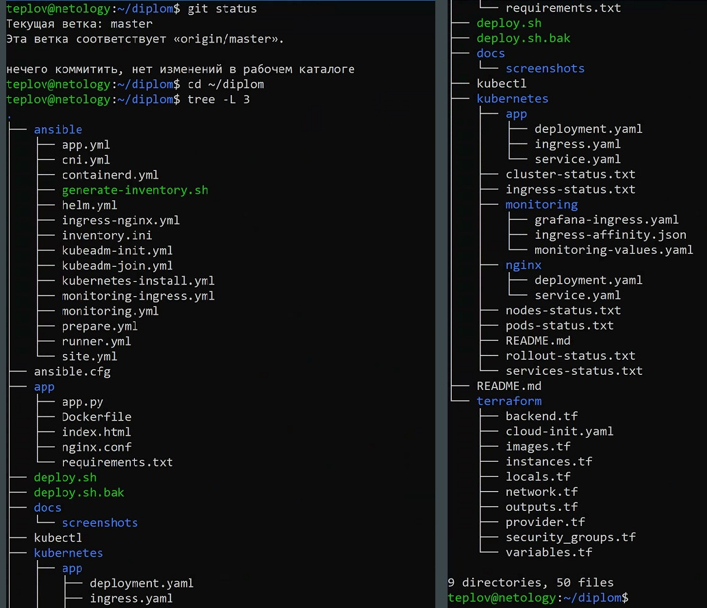
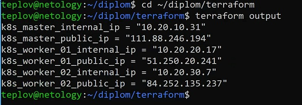
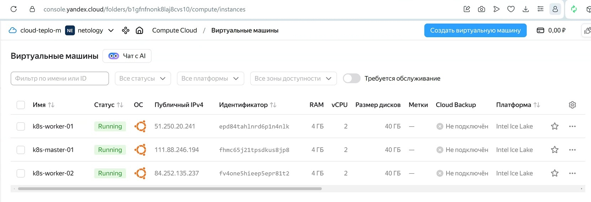
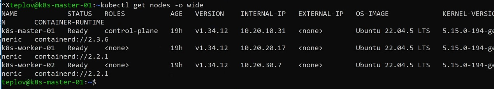
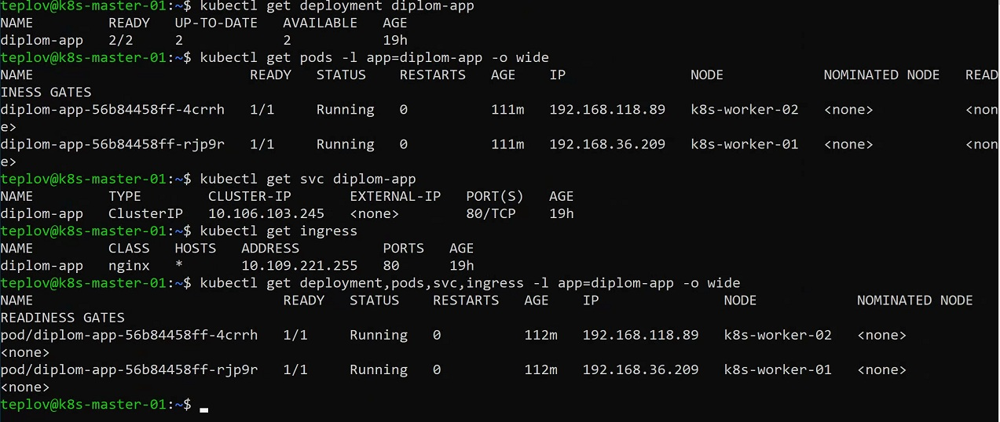
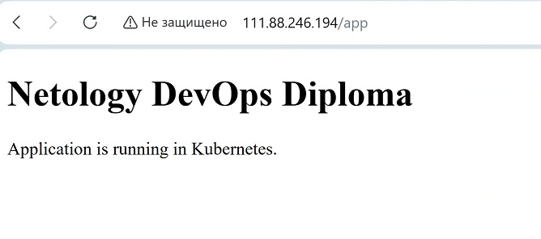
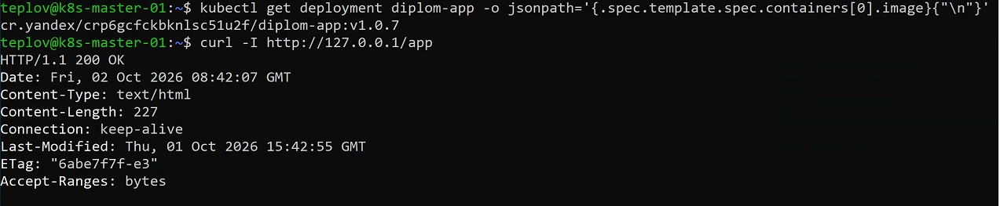
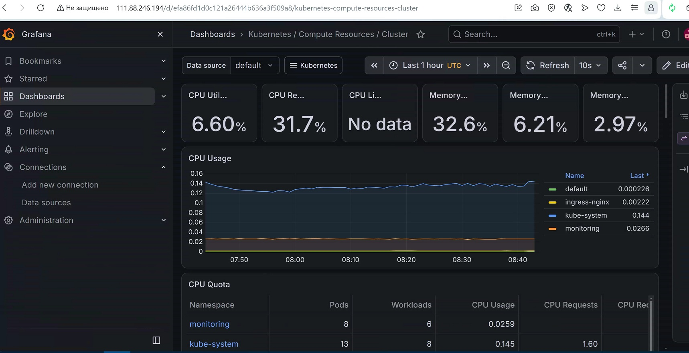

## Overview

Проект реализует полный цикл доставки приложения:

- создание инфраструктуры в Yandex Cloud через Terraform;
- настройка серверов через Ansible;
- развертывание Kubernetes кластера;
- сборка Docker image;
- публикация образа в Yandex Container Registry;
- автоматический deployment приложения через GitHub Actions.

---

## Architecture

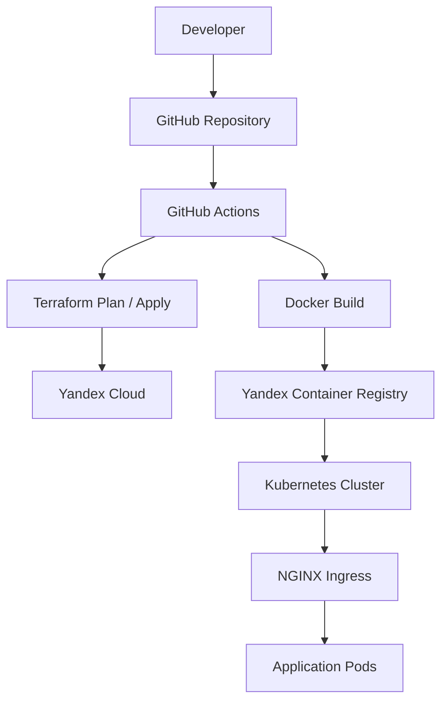


---

## Project structure

```text
.
├── app/                         # исходный код приложения
│
├── terraform/                   # Terraform конфигурация
│   ├── network.tf               # создание сети
│   ├── instances.tf             # виртуальные машины
│   ├── images.tf                # образы VM
│   ├── outputs.tf               # вывод IP и параметров
│   └── variables.tf             # переменные Terraform
│
├── ansible/                     # настройка серверов
│
├── kubernetes/                  # Kubernetes manifests
│   └── app/
│       ├── deployment.yaml      # Kubernetes Deployment
│       ├── service.yaml         # Kubernetes Service
│       └── ingress.yaml         # внешний доступ через NGINX
│
├── deploy.sh                    # автоматический запуск инфраструктуры
├── deploy.sh.bak                # резервная копия deploy script
│
├── .github/
│   └── workflows/
│       └── cicd.yml             # GitHub Actions CI/CD pipeline
│
├── docs/                        # дополнительная документация
│
├── ansible.cfg                  # конфигурация Ansible
│
└── README.md                    # документация проекта
```

## Components

| Component | Purpose |
|-----------|---------|
| Terraform | Создание инфраструктуры Yandex Cloud |
| Ansible | Первичная настройка серверов |
| Docker | Сборка контейнерного образа приложения |
| Yandex Container Registry | Хранение Docker image |
| Kubernetes | Запуск и управление приложением |
| NGINX Ingress | Внешний HTTP доступ |
| GitHub Actions | Автоматизация CI/CD pipeline |

---

# Initial deployment

Для полного развертывания используется:


./deploy.sh


Скрипт выполняет:

1. Подготовку окружения.
2. Terraform init.
3. Terraform plan/apply.
4. Создание инфраструктуры Yandex Cloud.
5. Настройку серверов через Ansible.
6. Подготовку Kubernetes.
7. Развертывание приложения.


## Проверка Kubernetes кластера

После выполнения установки проверить состояние нод:

```bash
kubectl get nodes
```

Ожидаемый результат:

```text
NAME            STATUS   ROLES           AGE   VERSION
k8s-master-01   Ready    control-plane   ...   ...
k8s-worker-01   Ready    <none>          ...   ...
k8s-worker-02   Ready    <none>          ...   ...
```

---

## Terraform Infrastructure

Terraform управляет инфраструктурой Yandex Cloud.

Создаются:

- VPC сеть;
- подсети;
- виртуальные машины;
- Kubernetes узлы.

### Terraform commands

Проверка конфигурации:

```bash
terraform validate
```

Создание плана изменений:

```bash
terraform plan
```

Применение инфраструктуры:

```bash
terraform apply
```

Получение информации о созданных ресурсах:

```bash
terraform output
```

Пример вывода:

```text
k8s_master_internal_ip = "10.20.10.31"
k8s_master_public_ip   = "111.88.246.194"

k8s_worker_01_internal_ip = "10.20.20.17"
k8s_worker_01_public_ip   = "51.250.20.241"

k8s_worker_02_internal_ip = "10.20.30.7"
k8s_worker_02_public_ip   = "84.252.135.237"
```


---

## Kubernetes

Приложение разворачивается и управляется в Kubernetes.

### Deployment

Проверка состояния Deployment:

```bash
kubectl get deployment diplom-app
```

Пример:

```text
NAME          READY   UP-TO-DATE   AVAILABLE
diplom-app    2/2     2            2
```

### Pods

Проверка запущенных контейнеров:

```bash
kubectl get pods -l app=diplom-app -o wide
```

Пример:

```text
NAME                           READY   STATUS    IP
diplom-app-xxxxxxxxxx-xxxxx    1/1     Running   192.168.x.x
diplom-app-xxxxxxxxxx-xxxxx    1/1     Running   192.168.x.x
```

### Service

Проверка Kubernetes Service:

```bash
kubectl get svc diplom-app
```

Пример:

```text
NAME          TYPE        CLUSTER-IP      PORT(S)
diplom-app    ClusterIP   10.x.x.x        80/TCP
```

### Ingress

Проверка внешнего доступа:

```bash
kubectl get ingress
```

Пример:

```text
NAME          CLASS   ADDRESS
diplom-app    nginx   10.x.x.x
```
---

## Kubernetes

Приложение разворачивается и управляется в Kubernetes.

Kubernetes manifests находятся в директории:

```text
kubernetes/app/
├── deployment.yaml
├── service.yaml
└── ingress.yaml
```

---

### Deployment

Deployment отвечает за запуск и управление репликами приложения.

Проверка состояния Deployment:

```bash
kubectl get deployment diplom-app
```

Пример результата:

```text
NAME          READY   UP-TO-DATE   AVAILABLE
diplom-app    2/2     2            2
```

---

### Pods

Проверка запущенных экземпляров приложения:

```bash
kubectl get pods -l app=diplom-app -o wide
```

Пример результата:

```text
NAME                           READY   STATUS    IP
diplom-app-xxxxxxxxxx-xxxxx    1/1     Running   192.168.x.x
diplom-app-xxxxxxxxxx-xxxxx    1/1     Running   192.168.x.x
```

Ожидаемый статус:

```text
STATUS: Running
READY: 1/1
```

---

### Service

Service предоставляет внутренний доступ к приложению внутри Kubernetes.

Проверка Service:

```bash
kubectl get svc diplom-app
```

Пример результата:

```text
NAME          TYPE        CLUSTER-IP      PORT(S)
diplom-app    ClusterIP   10.x.x.x        80/TCP
```

---

### Ingress

Ingress обеспечивает внешний HTTP доступ к приложению через NGINX Ingress Controller.

Проверка Ingress:

```bash
kubectl get ingress
```

Пример результата:

```text
NAME          CLASS   ADDRESS
diplom-app    nginx   10.x.x.x
```

Проверка доступности приложения:

```bash
curl -I http://<external-ip>/app
```

Ожидаемый результат:

```text
HTTP/1.1 200 OK
```
